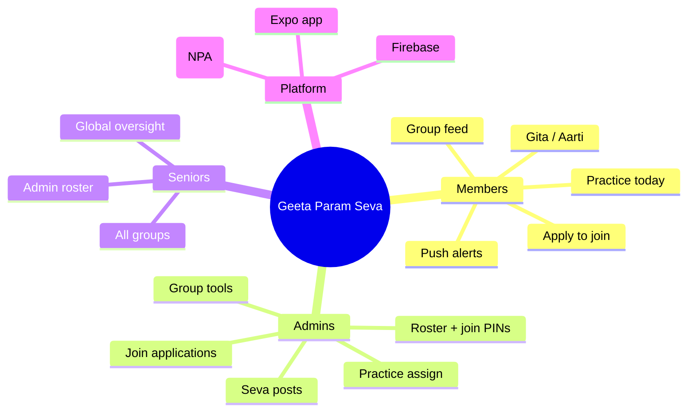
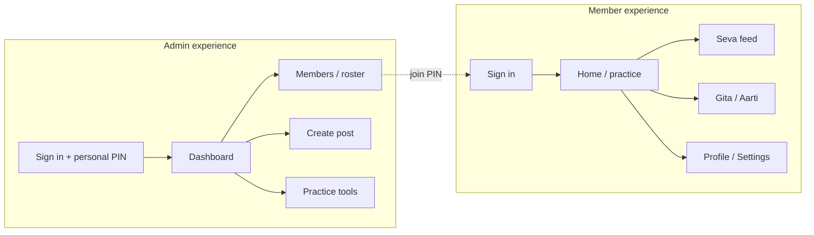
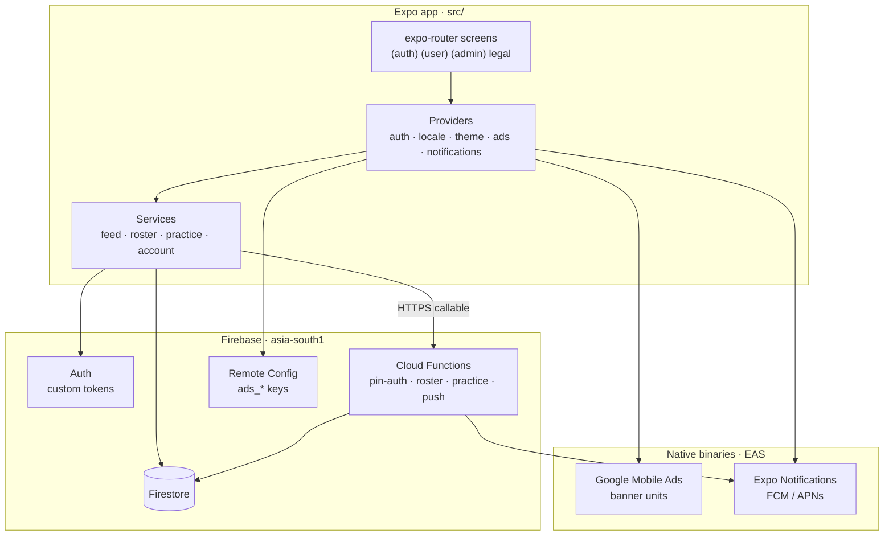
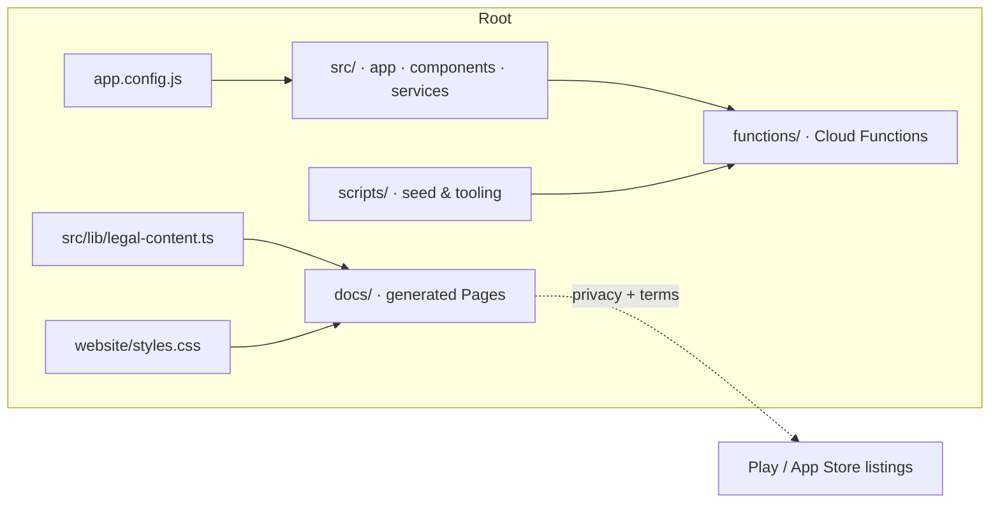
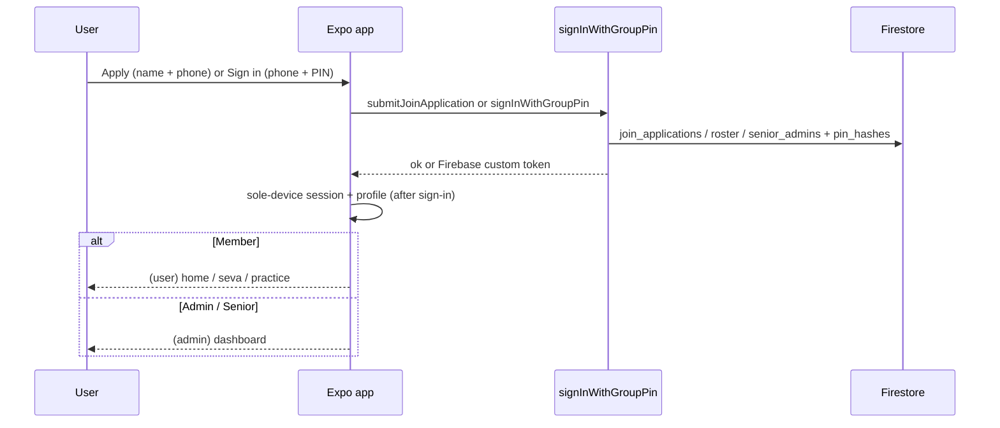
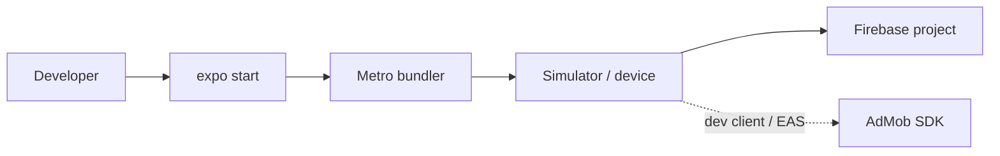

# Geeta Param Seva

Publicly downloadable community app for **Geeta Param Seva** — anyone can apply to join; admins approve membership. Approved members get seva updates, group messages, Adhyay/Aarti practice, Gita reading, and admin coordination tools.

Built with **Expo Router (SDK 57)**, **React Native**, **Firebase** (Auth custom tokens, Firestore, Cloud Functions, Remote Config), and optional **AdMob** banner ads (non-personalized; no App Tracking Transparency).

> **Proprietary software.** All rights reserved. You may not use, copy, modify, or distribute this codebase without prior written permission. Contact: [Sparshagrawaln@gmail.com](mailto:Sparshagrawaln@gmail.com)

---

## Table of contents

- [Overview](#overview)
- [Features](#features)
- [Architecture](#architecture)
- [Auth & roles](#auth--roles)
- [Tech stack](#tech-stack)
- [Setup](#setup)
- [Development](#development)
- [Backend deploy](#backend-deploy)
- [Banner ads](#banner-ads)
- [Legal (GitHub Pages)](#legal-github-pages)
- [Quality checks](#quality-checks)
- [License](#license)

---

## Overview



Geeta Param Seva is a **moderated community**: anyone may download the app and submit a join application (name + phone). Community features require admin approval, roster placement, and sign-in with phone + PIN.

---

## Features

| Area | What you get |
|------|----------------|
| **Auth** | Apply to join (name + phone); phone + group join PIN (members); personal PIN for admins after first login; sole-device session |
| **Feed** | Seva posts, messages, and alerts scoped to groups |
| **Practice** | Standing Adhyay / Aarti assignments with completion tracking |
| **Scripture** | In-app Gita chapters and verses |
| **i18n** | English + Hindi (with optional machine-assisted strings) |
| **Ads** | Member-only non-personalized banner ads (Remote Config kill switch); never on reading / auth screens; no ATT / IDFA tracking |
| **Admin** | Join applications, roster, join PIN rotation, content publishing, practice overview |



---

## Architecture



### Repo map



| Path | Role |
|------|------|
| `src/app/` | Expo Router routes (auth, member tabs, admin, legal) |
| `src/services/` | Firestore / Functions client APIs |
| `src/providers/` | Auth, ads, locale, theme, notifications |
| `functions/src/` | Callable + scheduled backend |
| `src/lib/legal-content.ts` | Source of truth for in-app + public legal copy |
| `website/styles.css` | Styles for the generated Pages site |
| `docs/` | Generated Privacy / Terms HTML (`npm run build:legal-pages`) |
| `scripts/` | Seeds, icon prep, APK helpers (local PII stays gitignored) |

---

## Auth & roles



| Role | Access |
|------|--------|
| **Applicant (signed out)** | Download app; submit join application |
| **Senior admin** | All groups; join applications; roster (members + admins); PINs; practice overview |
| **Admin** | Assigned groups; join applications; members; posts; practice |
| **Member** | Own group feed; today’s practice; polls; alerts |

Seniors are seeded only via Admin SDK scripts — never created inside the app UI.

---

## Tech stack

- **Client:** Expo SDK 57, Expo Router, React 19, React Native, NativeWind, Reanimated
- **Backend:** Firebase Auth, Firestore, Cloud Functions (`asia-south1`), Remote Config
- **Monetization:** `react-native-google-mobile-ads` (banners only)
- **Tooling:** TypeScript, Vitest, EAS Build, Firebase CLI

Expo versioned docs for this project’s generation: [docs.expo.dev/versions/v54.0.0](https://docs.expo.dev/versions/v54.0.0/) (see also current SDK notes in `AGENTS.md`).

---

## Setup

### Prerequisites

- Node.js `^20.19.4 \|\| ^22.13.0 \|\| >=24.3.0`
- Firebase project access + Application Default Credentials for seed scripts
- Expo / EAS CLI for store / device builds

### Install

```bash
npm install
cp .env.example .env
cp functions/.env.example functions/.env
cp google-services.json.example google-services.json
cp GoogleService-Info.plist.example GoogleService-Info.plist
# Replace example Firebase / AdMob values with your local secrets (never commit them)
```

### Local secret data (gitignored)

| File | Purpose |
|------|---------|
| `.env` | AdMob app IDs, feature flags |
| `google-services.json` / `GoogleService-Info.plist` | Firebase native config |
| `scripts/data/senior-admins.local.json` | Real senior phones (from `senior-admins.example.json`) |
| `scripts/data/group-1-roster.json` | Real roster PII (from `group-1-roster.example.json`) |

```bash
cp scripts/data/senior-admins.example.json scripts/data/senior-admins.local.json
# edit phones locally, then:
SENIOR_ADMIN_PIN=****** HRIDYA_SENIOR_ADMIN_PIN=****** node scripts/seed-senior-admin.cjs
```

QA / App Review accounts (valid Indian mobiles — override with env if needed):

```bash
# Deploy functions first if member personal-PIN login is not yet live, then:
node scripts/seed-test-accounts.cjs
# Admin:  +919876500001 / personal PIN 111111
# Member: +919876500002 / personal PIN 222222
# (attached to existing group-1; no QA test group)
```

---

## Development

```bash
npx expo start
# or
npm run android
npm run ios
```



Custom notification sound and production AdMob require a **development or EAS build** (not Expo Go).

---

## Backend deploy

```bash
npm run deploy:backend
```

Important callables include: `submitJoinApplication`, `listJoinApplications`, `rejectJoinApplication`, `markJoinApplicationAdded`, `signInWithGroupPin`, `generateGroupJoinPin`, `setPersonalPin`, roster upsert/deactivate, practice assignment/completion/reminder, `wipeDailyFeed`, `deleteAccount`.

---

## Banner ads

Member-only banners (no interstitial / video). Placement is scroll-bound and away from primary taps:

| Screen | Banners |
|--------|---------|
| Home | Up to 2 (slot 2 if height allows) |
| Seva | 1 after the feed |
| Profile | 1 at the bottom |
| Aarti / Gita / auth / notifications / admin | none |

1. Set `EXPO_PUBLIC_ADMOB_ANDROID_APP_ID` / `EXPO_PUBLIC_ADMOB_IOS_APP_ID` in `.env` or EAS secrets.
2. Publish Remote Config unit IDs + `ads_enabled` via `npm run seed:ads-config:apply`.
3. Rebuild a native binary.

---

## Legal (GitHub Pages)

Do **not** hand-edit `docs/*.html`. Regenerate from source:

```bash
npm run build:legal-pages
```

Pipeline: `src/lib/legal-content.ts` + `website/styles.css` → `scripts/build-legal-pages.mjs` → [`docs/`](./docs/). GitHub Actions (`.github/workflows/deploy-pages.yml`) runs the same build and deploys the artifact.

**Enable Pages once:** repo **Settings → Pages → Build and deployment → Source: GitHub Actions**. Then push to `main` (or run **Deploy legal pages** via Actions → workflow_dispatch).

| Page | URL |
|------|-----|
| Home | https://sparshagrawal07.github.io/Geeta-param-seva/ |
| Privacy Policy | https://sparshagrawal07.github.io/Geeta-param-seva/privacy-policy.html |
| Terms & Conditions | https://sparshagrawal07.github.io/Geeta-param-seva/terms.html |

In-app legal screens mirror the same member-facing copy and link out to these URLs (`LEGAL_PRIVACY_URL` / `LEGAL_TERMS_URL` in `src/lib/legal-content.ts`).

Support: [geetaparamseva@gmail.com](mailto:geetaparamseva@gmail.com) · Licensing: [Sparshagrawaln@gmail.com](mailto:Sparshagrawaln@gmail.com)

---

## Quality checks

```bash
npm test
npm run typecheck
npm run functions:build
```

---

## Builds (Android)

```bash
npm run build:android:apk          # EAS preview APK
npm run download:android:apk       # save → dist/Geeta-Param-Seva.apk
npm run build:android:aab          # Play Store AAB
npm run prepare:icons              # regenerate Expo icons from masters
```

---

## License

**Copyright © Sparsh Agrawal. All Rights Reserved.**

This repository is **not** open source. No permission is granted to use, copy, modify, merge, publish, distribute, sublicense, or sell any part of this software without **prior written permission**.

For permissions: **[Sparshagrawaln@gmail.com](mailto:Sparshagrawaln@gmail.com)**

See [`LICENSE`](./LICENSE). Package license field: `UNLICENSED`.
